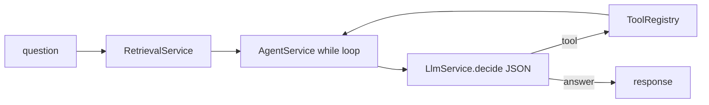

# LangChain 점진 도입 계획

## 현재 상태와 판단

이미 커스텀 ReAct 스택이 있습니다.

- LLM: OpenAI SDK → 호환 엔드포인트 ([`llm.service.ts`](apps/api/src/llm/llm.service.ts), [`ollama.service.ts`](apps/api/src/ollama/ollama.service.ts))
- Tools: 자체 `Tool` + `ToolRegistry` ([`tool.interface.ts`](apps/api/src/tools/interfaces/tool.interface.ts))
- RAG: Ollama embed + Qdrant ([`retrieval.service.ts`](apps/api/src/retrieval/retrieval.service.ts), [`qdrant.service.ts`](apps/api/src/qdrant/qdrant.service.ts))
- Agent: 수동 `while` decide 루프 ([`agent.service.ts`](apps/api/src/agent/agent.service.ts))

**권장 방향:** LangChain으로 전 스택을 갈아엎지 말고, Nest 모듈 경계를 유지한 채 **어댑터 → 도구 정규화 → Retriever → LangGraph agent** 순으로 교체합니다. 인덱싱(`*-document.ts`, type별 wipe)은 도메인 특화라 Nest에 유지합니다.

패키지 기준: `langchain` 모노리식보다 `@langchain/core`, `@langchain/openai`, `@langchain/langgraph`, 필요 시 `@langchain/community`(Qdrant) / `@langchain/ollama`.

---

## Phase 1 — LLM / Embeddings 어댑터 (회귀 최소)

Nest provider로 LangChain 객체를 감쌉니다.

- Chat: `ChatOpenAI({ configuration: { baseURL: LLM_BASE_URL }, model: ... })`로 현재 OpenAI-compatible chat 대체
- Embeddings: Ollama `bge-m3`를 LangChain `Embeddings` 구현(또는 `@langchain/ollama`)으로 감싸 [`EmbeddingService`](apps/api/src/embedding/embedding.service.ts) 내부만 교체
- [`LlmService.generate`](apps/api/src/llm/llm.service.ts)가 ChatModel을 쓰도록 바꾸고, `decide`/`RAG` API는 당분간 그대로 유지

목표: 동작·프롬프트 동일, “LLM 호출만 LC” 상태.

---

## Phase 2 — Tool 정규화 (필수 선행 작업)

현재 `searchByName` / `searchAll`이 도메인 간 중복되어 Map이 덮어쓸 수 있고, [`buildDecidePrompt`](apps/api/src/prompt/prompt.service.ts)의 하드코딩 이름과도 어긋납니다.

- 도구 이름을 네임스페이스화: `champion_searchByName`, `item_searchAll`, `trait_searchByName` 등
- 파라미터를 Zod 스키마로 정의하고 `DynamicStructuredTool` / `tool()`로 변환
- [`ToolRegistry`](apps/api/src/tools/tools.registry.ts)는 Nest DI를 유지하되 `toLangChainTools(): StructuredToolInterface[]` 빌더 추가
- decide 프롬프트의 도구명 규칙을 실제 등록명과 일치시킴

목표: LC agent로 넘겨도 안전한 tool 목록.

---

## Phase 3 — Retriever

- [`RetrievalService`](apps/api/src/retrieval/retrieval.service.ts)를 LangChain `BaseRetriever`로 감싸거나, 기존 Qdrant 클라이언트를 쓰는 thin retriever 유지
- Agent에는 지금처럼 **pre-retrieve context**를 system/context 메시지로 넣는 방식을 유지 (한 번에 retrieval-tool로 바꾸지 않음)
- [`RagService`](apps/api/src/rag/rag.service.ts)만 `retrieve → stuff documents → generate` 체인으로 단순화해 LC 연습용 첫 체인으로 사용

인덱싱·컬렉션(`TFT17`, type 필터, deterministic pointKey)은 [`QdrantService`](apps/api/src/qdrant/qdrant.service.ts) / indexer에 그대로 둡니다.

---

## Phase 4 — Agent 루프를 LangGraph로 교체

[`AgentService.test`](apps/api/src/agent/agent.service.ts)의 `while (true)` + 수동 JSON decide를 교체합니다.

- `@langchain/langgraph`의 tool-calling agent (`createReactAgent` 등) 사용
- system prompt에 기존 grounding 규칙 이전 (COMPLETED_ITEM만, 딜러/탱커 아이템 등)
- **max iterations**, tool 실패 시 관찰 메시지, 타임아웃 추가 (현재 무한 루프 가드 없음)
- Nest에서는 `AgentService`가 LangGraph runnable을 invoke만 하도록 유지 → HTTP/Swagger/모듈 구조 유지

JSON `parseJsonResponse` 기반 decide는 tool-calling이 안정화되면 제거.

---

## 유지할 것 / 하지 말 것

| 유지                              | LC로 옮기지 않음                |
| --------------------------------- | ------------------------------- |
| Nest 모듈·컨트롤러·DI             | Prisma 도메인 서비스 자체       |
| Indexing 파이프라인·document 빌더 | seed / DB 스키마                |
| Qdrant 컬렉션·payload 계약        | 전면 “LangChain-only” 앱 재작성 |

---

## 첫 구현 단위 (승인 후 바로 착수할 작업)

1. `apps/api`에 `@langchain/core`, `@langchain/openai` (및 embed용 패키지) 추가
2. `LangchainModule` provider: `CHAT_MODEL`, `EMBEDDINGS`
3. `LlmService.generate` / `EmbeddingService.embedding`만 어댑터로 연결
4. 도구 이름 네임스페이스 + Zod 스키마 정리 (Phase 2 시작)

이 순서면 기존 `/agent`, `/rag`, `/indexing` API를 깨지 않으면서 LC 도입 효과를 단계적으로 검증할 수 있습니다.
